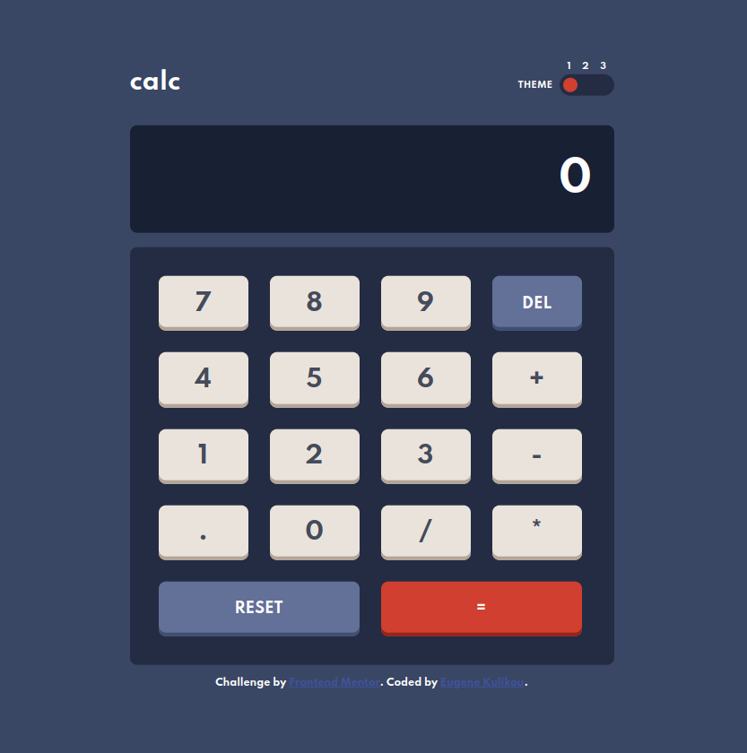
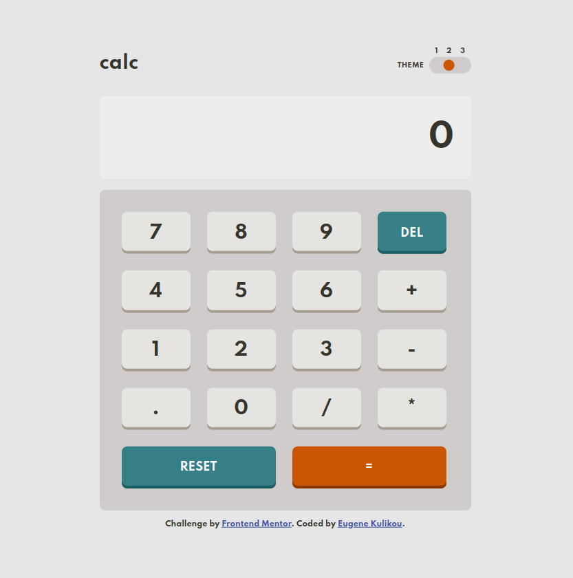
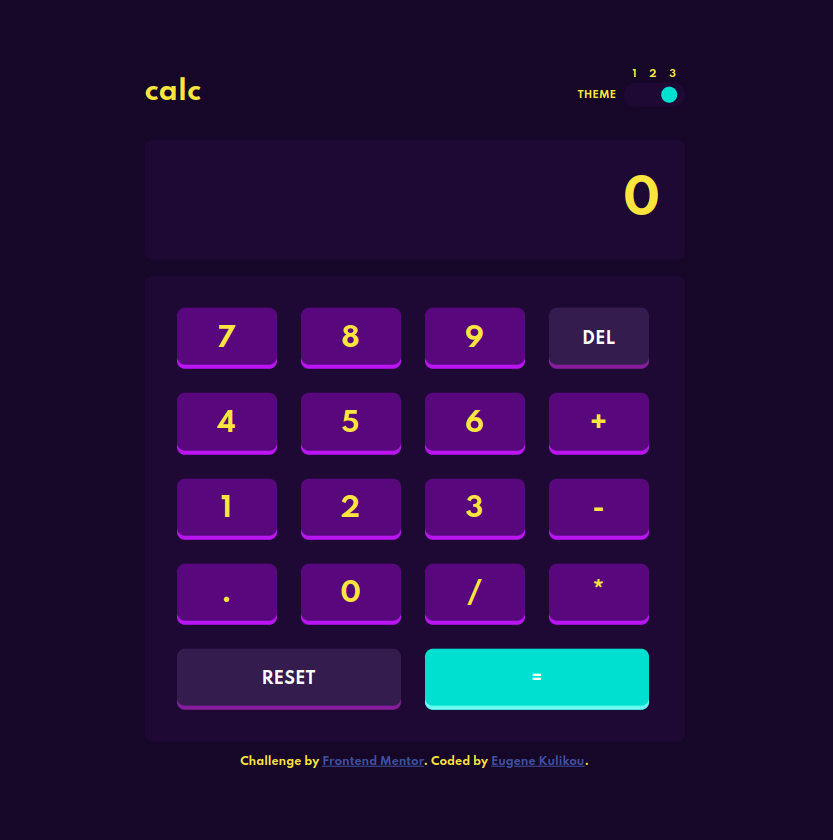

# Frontend Mentor - Calculator app solution

This is a solution to the [Calculator app challenge on Frontend Mentor](https://www.frontendmentor.io/challenges/calculator-app-9lteq5N29). Frontend Mentor challenges help you improve your coding skills by building realistic projects.

## Table of contents

- [Overview](#overview)
  - [The Brief](#the-challenge)
  - [Screenshot](#screenshot)
  - [Links](#links)
- [My process](#my-process)
  - [Built with](#built-with)
  - [Development Tools](#development-tools)
  - [What I learned](#what-i-learned)
  - [Continued development](#continued-development)
  - [Useful resources](#useful-resources)
- [Author](#author)
- [Acknowledgments](#acknowledgments)

## Overview

### The challenge

Users should be able to:

- See the size of the elements adjust based on their device's screen size
- Perform mathmatical operations like addition, subtraction, multiplication, and division
- Adjust the color theme based on their preference
- **Bonus**: Have their initial theme preference checked using `prefers-color-scheme` and have any additional changes saved in the browser

### Screenshot



<!-- 
 -->

### Links

<!-- - Solution URL: [Add solution URL here](https://your-solution-url.com) -->
- Live Site URL: [vanillajs-responsive-multitheme-calc.vercel.app](https://vanillajs-responsive-multitheme-calc.vercel.app/)

## My process

### Built with

- Semantic HTML5 markup
- Accessability
- Mobile-first workflow
- CSS (GRID, custom properties, media-queries, relative sizing units, color transitions)
- [CSS Reset](./assets/reset.css)
- Vanilla JS
- Local Storage, prefers-color-scheme APIs
- No build step

### Development Tools

- VS Code
- [http-server](https://www.npmjs.com/package/http-server) to have hot-reload

### What I learned

I've used the [event delegation](https://javascript.info/event-delegation) pattern to handle clicks over the keypad instead of adding an event listener to each button.

Utilizing this technique optimizes performance and reduce memory usage by minimizing the number of event listeners.

I use it quite often, especially in cases where there are multiple dynamically generated elements or when handling events on a large number of elements.

```js
  function handleKeypadInput(event) {
    if (event.target.tagName !== "BUTTON") {
      return;
    }

    const button = event.target;
    const buttonValue = button.getAttribute("data-id");
    ...
  }
```

For theme switcher I used `calc()` function to vertically align slider position to its labels withing absolute positioning.

```css
/* some lines omitted */

:root {
  --slider-width: 2.725rem;
  --slider-position-step: calc(var(--slider-width) / 2.625);
}

html[data-theme="dark"] .slider:before {
  transform: translateX(0rem);
}

html[data-theme="light"] .slider:before {
  transform: translateX(var(--slider-position-step));
}

html[data-theme="violet"] .slider:before {
  transform: translateX(calc(var(--slider-position-step) * 2));
}
```

### Continued development

Continued development includes enhancing desktop user support by implementing device keyboard input, streamlining user experience with potential features like playing sound on key-press.

As the project is aimed to give me more practice in features I don't work on in my day-to-day job, I wish to find room to use the latest CSS features released, such as the `:has()` pseudo-class and `prefers-color-scheme` media query.

### Useful resources

- [The Perfect Theme Switch Component](https://www.aleksandrhovhannisyan.com/blog/the-perfect-theme-switch/) - This helped me to find a great approach for implementing the theme switch. I really liked this pattern and will use it going forward.
- [Can-I-Use](https://caniuse.com/) - &quot;Can I use&quot; provides up-to-date browser support tables for support of front-end web technologies on desktop and mobile web browsers. Check it every time before using cutting edge CSS property or Web Browser API.

## Author

- Frontend Mentor - [@evk11](https://www.frontendmentor.io/profile/evk11)
- LinkedIn - [@eugenekulikou](https://www.linkedin.com/in/eugenekulikou/)
